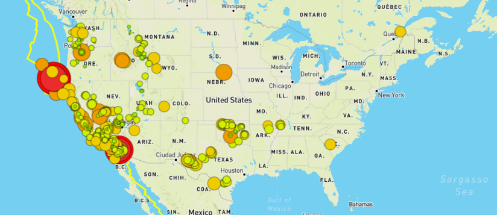
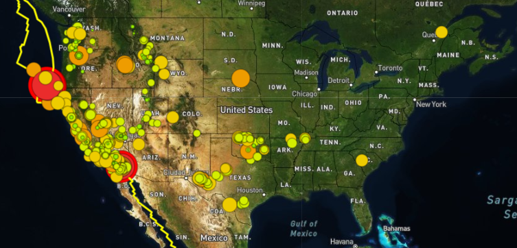
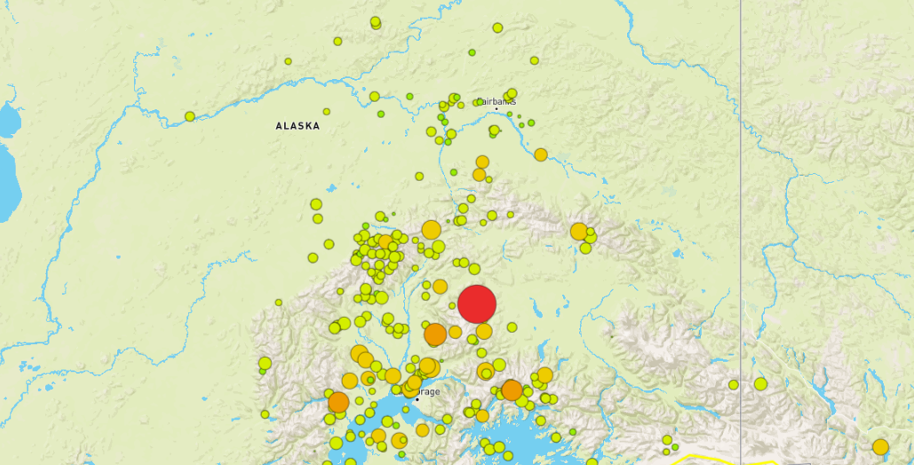

# Mapping Earthquakes

### Earthquakes are happening around the world everyday. Sometimes they are devestating, but many are minor and go unoticed. 

This mapping analysis uses real-time data from the United States Geological Sruvey (USGS) earthquake hazards program to map global earthquakes which have occured over the last seven days. 

The map displays earthquakes, color coded by magnitude, and global tectonic plate borders, along which most earthquakes tend to occur. Users may select to view the data on a standard map or swith the view to sattelite or topographic. 

Each data layer may also be toggled on and off allowing users to view earthquakes or tectonic plate data individually. 

Example Output 

Satellite View 

Topographic View 

